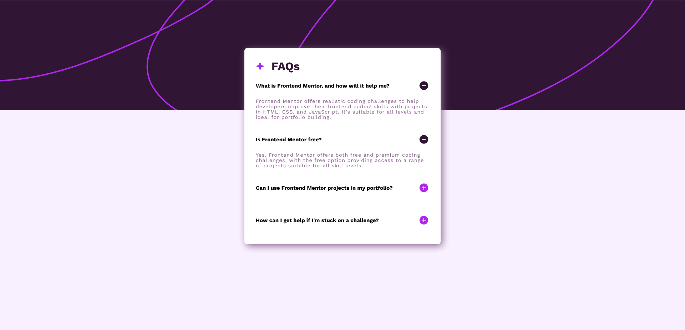

# Frontend Mentor - FAQs solution

This is a solution to the [FAQs challenge on Frontend Mentor](https://www.frontendmentor.io/challenges/faq-accordion-wyfFdeBwBz). Frontend Mentor challenges help you improve your coding skills by building realistic projects. 

## Table of contents

- [Overview](#overview)
  - [The challenge](#the-challenge)
  - [Screenshot](#screenshot)
  - [Links](#links)
- [My process](#my-process)
  - [Built with](#built-with)
  - [What I learned](#what-i-learned)
  - [Useful resources](#useful-resources)
- [Author](#author)

## Overview

### The challenge

Users should be able to:

- See hover and focus states for all interactive elements on the page
- Interactive accordion component.

### Screenshot

### Links

- Solution URL: [FEM-FAQ](https://github.com/EJMK18/FEM-FAQ)
- Live Site URL: [FAQ Challenge](https://ejmk18.github.io/FEM-FAQ/)

### Built with

- Semantic HTML5 markup
- CSS custom properties
- Flexbox
- CSS Grid
- JavaScript

### What I learned

### Useful resources

- [Mozilla Development Network](https://developer.mozilla.org/en-US/) 
- [Stackoverflow](https://stackoverflow.com/)

## Author

- Frontend Mentor - [@EJMK18](https://www.frontendmentor.io/profile/EJMK18)
- Twitter - [@ejmk18](https://www.twitter.com/ejmk18)
